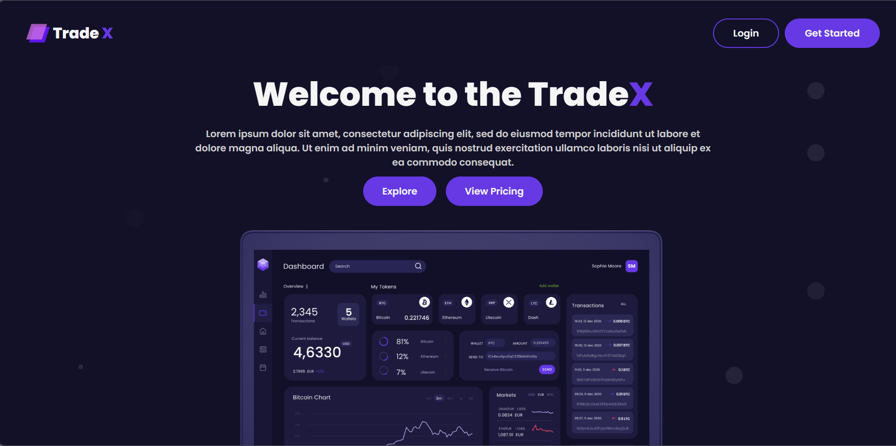
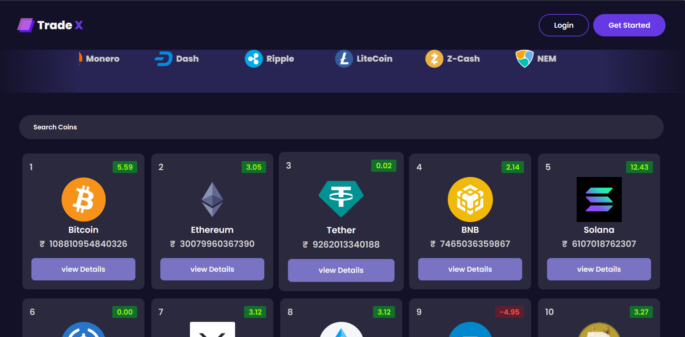
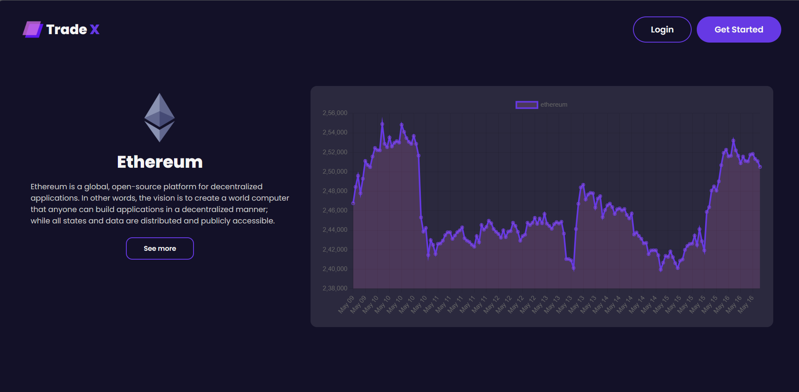

# Tradex

Welcome to Tradex! This project is a React-based web application designed to visualize stock data in an interactive and user-friendly way. With a range of features, this tool allows users to analyze stock performance, trends, and more.



## Features

- **Interactive Charts**: Visualize stock data using interactive and customizable charts.
- **Stock Comparison**: Compare the performance of multiple stocks on the same chart.
- **Historical Data Analysis**: View historical data to understand past trends and patterns.
- **Real-time Updates**: Stay up-to-date with real-time data updates for selected stocks.
- **User-friendly Interface**: Intuitive and easy-to-use interface for seamless navigation and interaction.

## Getting Started

To get started with Stock Visualizer, follow these steps:

1. Clone the repository:

```bash
git clone https://github.com/phaneendra-nikhil/Tradex.git
```

2. Install dependencies:
```bash
cd stock-visualizer
npm install
```
3. Start development server:
```bash
npm start
```
4. Open your browser and navigate to <a>http://localhost:3000</a> to view the application.
   
## Usage

Once the application is running, you can start exploring stock data:
- Enter a stock symbol or name in the search bar to visualize its data.
- Use the date range selector to specify the time for data visualization.
- Compare multiple stocks by entering additional symbols or names in the comparison field.

<div>
   </img>
   </img>
</div>

## Contributing
Contributions are welcome! If you'd like to contribute to Stock Visualizer, please follow these steps:

1. Fork the repository.
2. Create a new branch (git checkout -b feature/improvement).
3. Make your changes.
4. Commit your changes (git commit -m 'Add feature/improvement').
5. Push to the branch (git push origin feature/improvement).
6. Create a new Pull Request.

## License
This project is licensed under the **Apache** License.

## Acknowledgments

- React - A JavaScript library for building user interfaces.
- Chart.js - Simple yet flexible JavaScript charting library.
- Coin Gecko - API used for stock market data.
